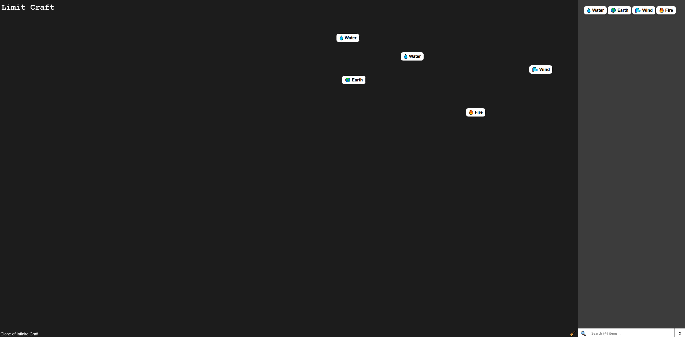
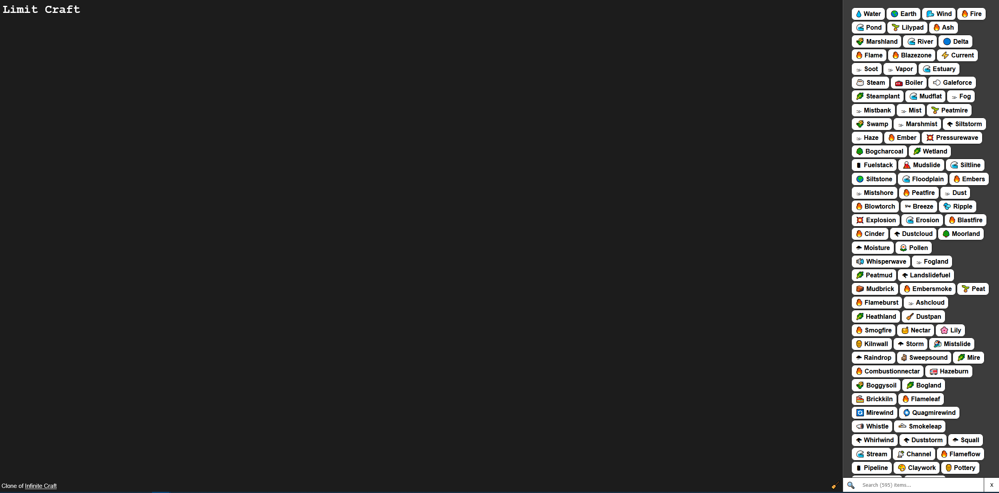
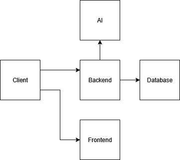
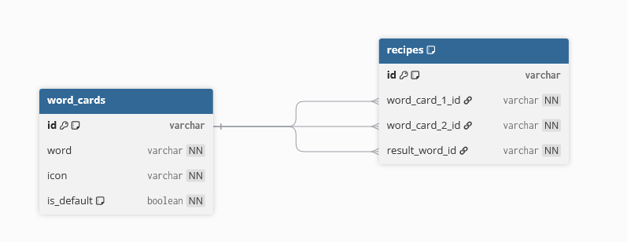

# LimitCraft

A Clone of Infinitecraft

## How it works

First, there is the UI. it looks intentionally similar to the original.\
You have a big "playground" to the right and a Sidebar to the left.\
Initially the sidebar has 4 Elements: Water, Earth, Wind and Fire.\
You can now drag one of these 4 elements into the playground area.\
Once placed, it stays there. It is now possible to take another element and place it over the first.\
Then, the "magic" happens: The two elements disappear and a new one appears. \
The new element is the combination of the two words combined.\
The newly discovered Element will now be accessible in the sidebar.

## How it works Technically

When you first start the webapp, it makes a get request to the backend, to get the 4 initial elements. \
When you load the app a second time, it loads the playground and sidebar cards from the local storage from the browser.

When you combine two cards in the playground area, it sends a POST request to the backend with the IDs of the two word cards.\
The backend then checks if that specific recipe was already done before (by a lookup in the Database).\
If it is already in the Database, it returns the saved result. This is very fast and not noticeable by the user.\
When the user is the first one that has discovered this recipe/element, the backend makes a post request to the Ollama Docker container, which uses the phi4:14b AI model and a prompt to figure out, what element would come out, when you combine does two specific other elements.\
then, returns it to the client. This takes some time, because the AI is not that fast...\
for this task, there will spawn a loading card in the users interface.

## Features

- Drag 'n Drop word cards
- Double click on cards in sidebar to spawn them in the playground area
- Double click on card in playground area to spawn them in the playground area
- Button to Delete all the cards in the playground area
- Combine two words to another that is related
- Searchbar for all the elements in the sidebar

## Screenshots

Initial State (with some cards in the playground area)



Some elements are already discovered



## Big Picture

Overview of the System



## API endpoints

**GET /api/v1/cards/**

- Get Initial (4) Cards

**POST /api/v1/cards/**

- Combine two cards together (parameters: wordCardId1 and wordCardId2)

## Tech used

### Infrastructure

- Docker

### Frontend

- Angular
  - @angular/cdk -> Used for Drag 'n Drop
- Typescript
- CSS
- HTML

### Backend

- Spring Boot
  - JPA -> ORM
  - Jboss Resteasy Client -> http client
- Java

### Database

- MariaDB

### AI

- Ollama Docker container
- phi4:14b Model

## Database



# Dev Setup

```bash
cd ./
docker compose up -d

cd backend
mvn spring-boot:run

cd ../frontend
ng serve
```

# Source

- Original: https://neal.fun/infinite-craft/
- Other clone / Inspiration: https://github.com/bufferhead-code/opencraft

- Credit Number one goes to: https://chatgpt.com

# Build Live Stream && Showcase Videos

**Video:**

- TODO:

**Streams:**

- (1) https://www.youtube.com/watch?v=U_v_1v-6SI8
- (2) https://www.youtube.com/watch?v=9g6taVmpLiA
- (3) https://www.youtube.com/watch?v=_tC-RjEIBBk
